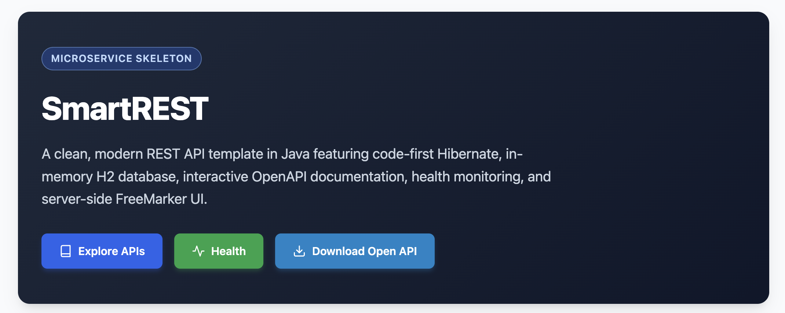

# Smart REST - Java Edition

[](https://opensource.org/licenses/ISC)



A template REST API project with

* SpringBoot (Java 26 + Lombok)
* JPA (H2 DB in memory)
* API REST with Swagger site
* Apache FreeMarker Template


Are you looking for SmartREST Kotlin Edition? Here it is: https://github.com/guildenstern70/SmartREST

---

## Container Instructions

You can build and run the application container using either **Docker** or **Podman**.

### 1. Using Docker

#### Build the image
```bash
docker build -t smartrest:latest .
```

#### Run the container
```bash
docker run -d --name smartrest-app -p 8080:8080 smartrest:latest
```

#### Stop and remove container
```bash
docker stop smartrest-app && docker rm smartrest-app
```

---

### 2. Using Podman

> **Note for macOS users**: Ensure your Podman VM is running (`podman machine start`) before executing commands.

#### Build the image
```bash
podman build -t smartrest:latest .
```

#### Run the container
```bash
podman run -d --name smartrest-app -p 8080:8080 smartrest:latest
```

#### Stop and remove container
```bash
podman stop smartrest-app && podman rm smartrest-app
```

---

### Useful Endpoints

Once the container is running on port `8080`:

* **Home Page**: [http://localhost:8080/](http://localhost:8080/)
* **System Alive**: [http://localhost:8080/api/alive](http://localhost:8080/api/alive)
* **Swagger UI**: [http://localhost:8080/swagger-ui/index.html](http://localhost:8080/swagger-ui/index.html)
* **Actuator Health**: [http://localhost:8080/actuator/health](http://localhost:8080/actuator/health)

